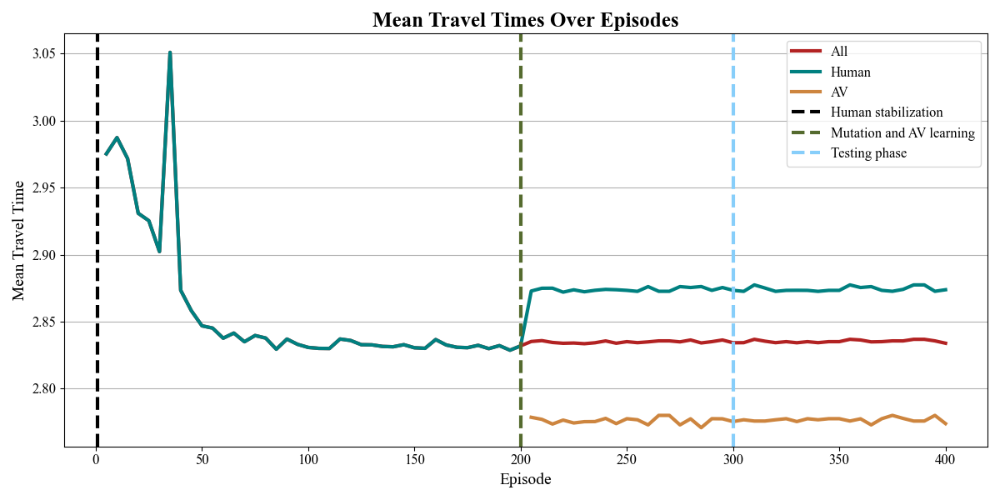
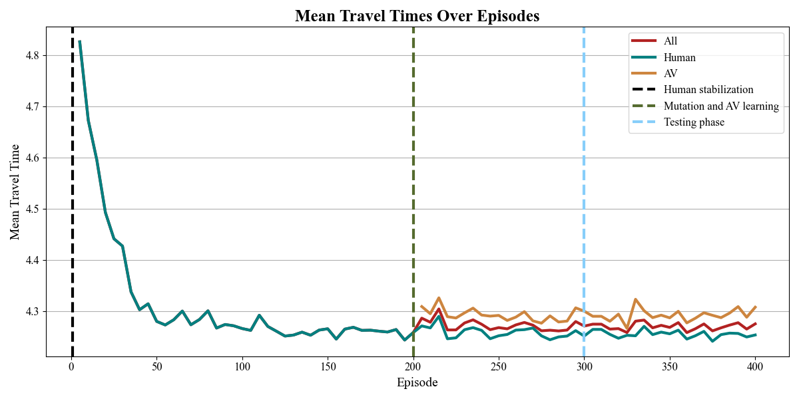

### Results

Provided experiment scripts store experiment results in this directory, under the folder name determined by the **experiment identifier**.

The structure of this result data is demonstrated with some sample results provided in this directory. In summary, this data includes:
- Experiment configuration values (`exp_config.json`).
- Demand and route generation data. (XML and CSV files.)
- Tracked loss values for the used algorithm. (`losses/`)
- Episode-level data logs. (`episodes/`)
- Simulation statistics yielded by SUMO. (`SUMO_output/`)
- Experiment data visualizations from RouteRL. (`plots/`)

## Experiment results

#### Simulation results for MARL algorithms and baselines in _St. Arnoult_ for 40% AVs

| **Algorithm** | ${t^{\text{\textbf{pre}}}}$ | ${t^{\text{\textbf{test}}}}$ | ${t_{\text{\textbf{CAV}}}}$ | ${t_{\text{\textbf{HDV}}}^{\text{\textbf{post}}}}$ | ${c_{\text{\textbf{all}}}}$ | ${c_{\text{\textbf{HDV}}}}$ | ${c_{\text{\textbf{CAV}}}}$ | ${\Delta_{\text{\textbf{V}}}}$ | ${\Delta_{\text{\textbf{l}}}}$ | ${\text{\textbf{WR}}}$ |
|------------------|--------------------------------|---------------------------------|--------------------------------|-------------------------------------------------------|--------------------------------|--------------------------------|--------------------------------|-----------------------------------|-----------------------------------|---------------------------|
| IPPO  | 3.15  | 3.28  | 3.34 | 3.24  | 0.6 | 0.12 | 1.33 | -0.31 | 0.05 | 0\%                       |
| IQL   | 3.15                           | 3.34                            | 3.49                           | 3.24                                                  | 0.66                           | 0.14                           | 1.44                           | -0.42                             | 0.08                              | 0\%                       |
| MAPPO | 3.15                           | 3.32                            | 3.43                           | 3.25                                                  | 0.66                           | 0.14                           | 1.45                           | -0.27                             | 0.08                              | 0\%                       |
| QMIX  | 3.15                           | 3.2                             | 3.12                           | 3.25                                                  | 0.65                           | 0.13                           | 1.43                           | -0.2                              | 0.01                              | 66\%                      |
| AON              | 3.15                           | 3.15                            | 3.01                           | 3.25                                                  | 0.55                           | 0.09                           | 1.21                           | -0.06                             | -0.0                              | 100\%                     |
| Greedy  |  3.15 | 3.15 | 3.01 | 3.24     | 0.02 | 0.02 | 0.02 | 0.01 | 0.00 | 100% |
| Human            | 3.15                           | 3.15                            | 3.15                           | 3.15                                                  | 0.0                            | 0.0                            | 0.0                            | 0                                 | 0.0                               | 100\%                     |
| Random           | 3.15                           | 3.38                            | 3.58                           | 3.25                                                  | 0.6                            | 0.09                           | 1.36                           | -0.33                             | 0.1                               | 0\%                       |

#### Simulation results for MARL algorithms and baselines in _Provins_ for 40% AVs

| **Algorithm** | ${t^{\text{\textbf{pre}}}}$ | ${t^{\text{\textbf{test}}}}$ | ${t_{\text{\textbf{CAV}}}}$ | ${t_{\text{\textbf{HDV}}}^{\text{\textbf{post}}}}$ | ${c_{\text{\textbf{all}}}}$ | ${c_{\text{\textbf{HDV}}}}$ | ${c_{\text{\textbf{CAV}}}}$ | ${\Delta_{\text{\textbf{V}}}}$ | ${\Delta_{\text{\textbf{l}}}}$ | ${\text{\textbf{WR}}}$ |
|---------------|----------------------------|------------------------------|-----------------------------|----------------------------------------------------|-----------------------------|-----------------------------|------------------------------|--------------------------------|--------------------------------|------------------------|
| IPPO          | 2.8                        | 2.88                         | 2.92                        | 2.85                                               | 0.53                        | 0.26                        | 0.93                         | -0.4                           | 0.03                           | 0\%                    |
| IQL           | 2.8                        | 2.92                         | 3.03                        | 2.84                                               | 1.48                        | 0.98                        | 2.23                         | -0.52                          | 0.06                           | 0\%                    |
| MAPPO         | 2.8                        | 2.92                         | 3.03                        | 2.85                                               | 1.23                        | 0.81                        | 1.87                         | -0.64                          | 0.06                           | 0\%                    |
| QMIX          | 2.8                        | 2.96                         | 3.14                        | 2.85                                               | 0.88                        | 0.54                        | 1.41                         | -0.8                           | 0.07                           | 0\%                    |
| AON           | 2.8                        | 2.81                         | 2.76                        | 2.84                                               | 0.47                        | 0.19                        | 0.99                         | -0.14                          | -0.0                           | 100\%                  |
| Greedy    |   2.8    |  2.80 | 2.74 |  2.84     | 0.05 | 0.05 | 0.06 | 0.01 | 0.00 | 100% |
| Human         | 2.8                        | 2.8                          | 2.8                         | 2.8                                                | 0.0                         | 0.0                         | 0.0                          | 0.0                            | 0.0                            | 100\%                  |
| Random        | 2.8                        | 2.93                         | 3.04                        | 2.85                                               | 0.51                        | 0.22                        | 0.95                         | -0.62                          | 0.06                           | 0\%                    |

#### Simulation results for MARL algorithms and baselines in _Ingolstadt_ for 40% AVs

| **Algorithm** | ${t^{\text{\textbf{pre}}}}$ | ${t^{\text{\textbf{test}}}}$ | ${t_{\text{\textbf{CAV}}}}$ | ${t_{\text{\textbf{HDV}}}^{\text{\textbf{post}}}}$ | ${c_{\text{\textbf{all}}}}$ | ${c_{\text{\textbf{HDV}}}}$ | ${c_{\text{\textbf{CAV}}}}$ | ${\Delta_{\text{\textbf{V}}}}$ | ${\Delta_{\text{\textbf{l}}}}$ | ${\text{\textbf{WR}}}$ |
|------------------|-----------------------------|------------------------------|-----------------------------|----------------------------------------------------|-----------------------------|-----------------------------|-----------------------------|--------------------------------|--------------------------------|------------------------|
| IPPO             | 4.21                        | 4.4                          | 4.72                        | 4.18                                               | 1.76                        | 1.22                        | 2.56                        | -0.37                          | 0.07                           | 0\%                    |
| IQL              | 4.21                        | 4.45                         | 4.8                         | 4.22                                               | 1.68                        | 1.08                        | 2.59                        | -0.62                          | 0.07                           | 0\%                    |
| MAPPO            | 4.21                        | 4.44                         | 4.81                        | 4.2                                                | 1.82                        | 1.21                        | 2.75                        | -0.62                          | 0.07                           | 0\%                    |
| QMIX             | 4.21                        | 4.36                         | 4.55                        | 4.23                                               | 1.2                         | 0.67                        | 1.98                        | -0.73                          | 0.02                           | 0\%                    |
| AON  | 4.21  | 4.29  | 4.37 | 4.23 | 0.87  | 0.55  | 0.24  | -0.45  | -0.01  | 0\%  |
| Greedy    |   4.21    | 4.22     | 4.24 | 4.20 | 0.26 | 0.25 | 0.27     | -0.06    | 0.00      | 0%       |
| Human            | 4.21                        | 4.21                         | 4.21                        | 4.21                                               | 0.0                         | 0.0                         | 0.0                         | 0.0                            | 0.0                            | 100\%                  |
| Random           | 4.21                        | 4.45                         | 4.81                        | 4.22                                               | 0.99                        | 0.49                        | 1.74                        | -0.68                          | 0.07                           | 0\%                    |

---

##  Travel times across episodes

Results for the **IPPO**, **IQL**, **MAPPO**, and **QMIX** MARL algorithms, as well as the **AON**, **human**, and **random** baselines, are available in [https://arxiv.org/abs/2505.17734](https://arxiv.org/abs/2505.17734). 
Selected results from later experiments are shown below.

All plots correspond to *Scenario 1* (40% AV) with $environment\_seed = 42$.  

<table>
  <tr>
    <td align="center">
       
      Scenario 1, Saint Arnoult, Greedy baseline
    </td>
    <td align="center">
       
      Scenario 1, Provins, Greedy baseline
    </td>
    <td align="center">
       
      Scenario 1, Ingolstadt, Greedy baseline
    </td>
  </tr>
</table>
